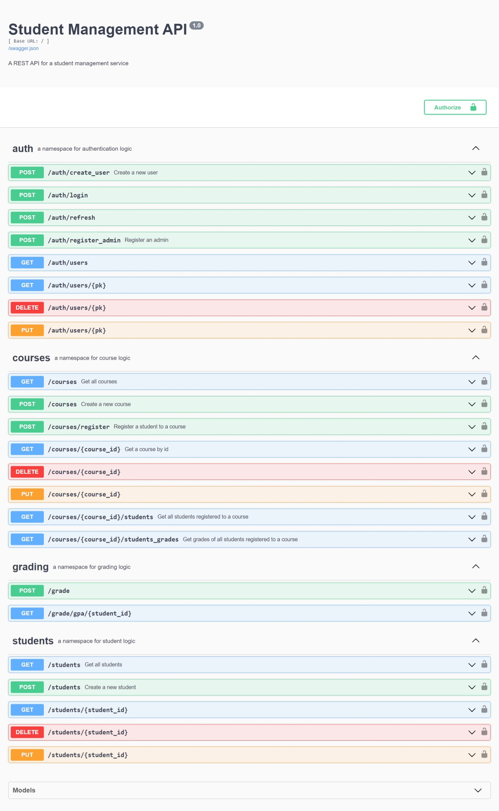

# **Student Management API with Flask Restx**

## **About**
This is a Flask Rest API service that has endpoints for managing students in a typical school setting.
Users can be registered as administrators, students or teachers.
Basic functionalities include:
- registration of students
- retrieving, updating and deletion of students' and other users' details
- registration of courses for students and teachers
- updating, retrieving and deletion of courses
- grading of students for each course
- Calculation of final GPA for students based on scores in each course

This API service is deployed on [pythonanywhere](http://priscillab.pythonanywhere.com/) with endpoints secured using JWT tokens for authentication and authorization.

This project was built as a final project submission for my [AltSchool Africa School of Engineering](https://www.altschoolafrica.com/schools/engineering) education.

## **How to Use**

### **As an API Client User**
- Access the project deployment on [pythonanywhere](http://priscillab.pythonanywhere.com/)
- On the project home page, go through the list of project endpoints and their various descriptions to get an understanding of the service.
- To test the service, create an administrator accounting using the `/auth/register_admin` endpoint. Only admins have access to endpoints that involve creation, update or deletion of any data.
- After registering as admin, you can login using the `/auth/login` endpoint
- After logging in, you will get access to a JWT access token, which can be used to authorize your access to the service.
- To execute the authorization, click on the **Authorize** button on the Swagger UI and paste the access token in the value section of the pop up dialog.
- You can also authorize per endpoint basis, by clicking the lock button on each endpoint.
- You can then create accounts for students, teachers and other admins and test any of the endpoints
- Note: There is a separate endpoint for creating students, that include extra data such as a custom student id which is used to access and update student data. When a student is created from this endpoint, a user account is also automatically created for the student

### **As a developer/contributor**
- Fork this repository, and clone your fork to your local computer
- To run the project, you can run `python app.py ` in your console on the main project directory to start a server
- You can create an admin account using the cli command `python manage.py create_admin`
- Alternatively, you can use the `/auth/register_admin` endpoint to create an admin account using the swagger UI on your local client or using a third party app like *Insomnia* or *Postman* to access the endpoint.
- You can test various endpoints and go through the codebase to understand the API logic.
- You can make contributions by making changes to your local fork and sending a pull request via github
- Note: There is a separate endpoint for creating students, that include extra data such as a custom student id which is used to access and update student data. When a student is created from this endpoint, a user account is also automatically created for the student
