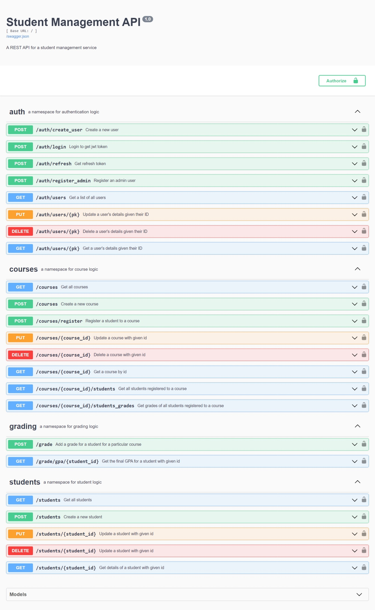

# **Student Management API with Flask Restx**

## **About**
This is a Flask Rest API service that has endpoints for managing students in a typical school setting.
Users can be registered as administrators, students or teachers.
Basic functionalities include:
- registration of students
- retrieving, updating and deletion of students' and other users' details
- registration of courses for students and teachers
- updating, retrieving and deletion of courses
- grading of students for each course
- Calculation of final GPA for students based on scores in each course

This API service is deployed on [pythonanywhere](http://priscillab.pythonanywhere.com/) with endpoints secured using JWT tokens for authentication and authorization.

This project was built as a final project submission for my [AltSchool Africa School of Engineering](https://www.altschoolafrica.com/schools/engineering) education.

## How to Use

### As an API Client User
- Access the project deployment on [pythonanywhere](http://priscillab.pythonanywhere.com/)
- On the project home page, go through the list of project endpoints and their various descriptions to get an understanding of the service.
- To test the service, create an administration accounting using the </auth/register_admin> endpoint
### As a developer/contributor
- Fork this repository, and clone your fork to your local computer
